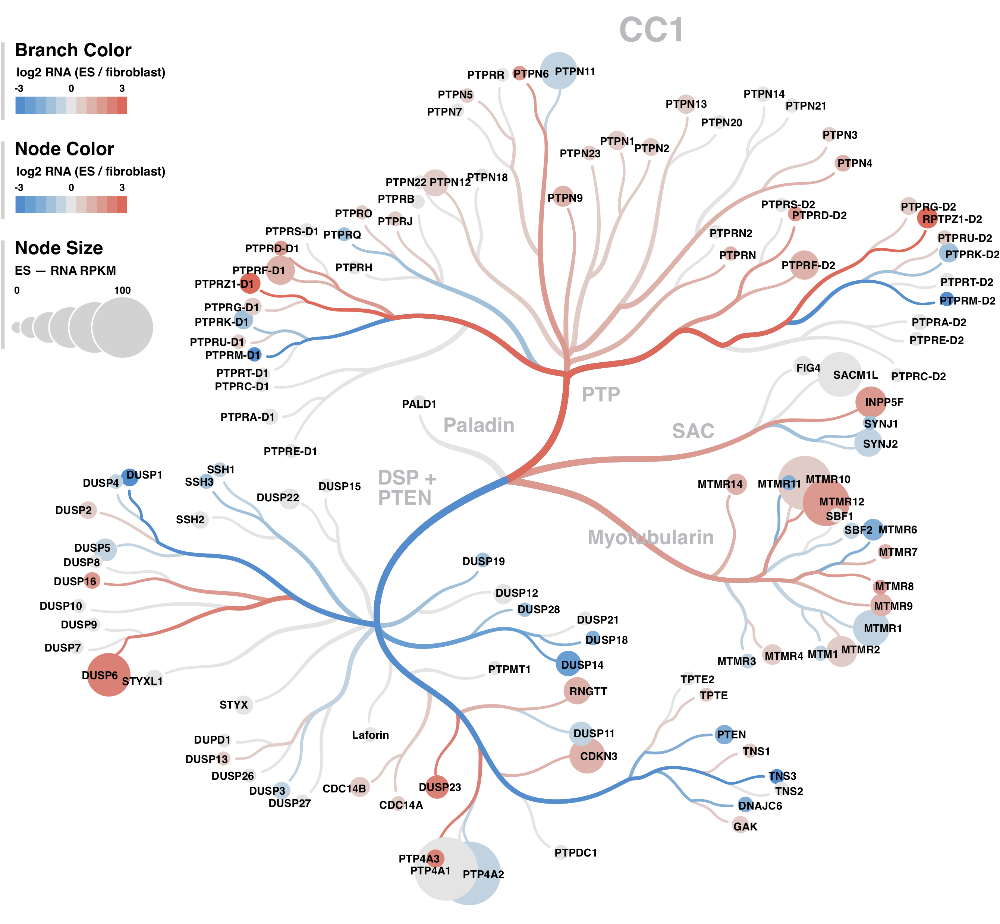

# Summary

Protein phosphatases and kinases play critical roles in a host of biological processes and diseases via the removal and addition of phosphoryl groups. While kinases have been extensively studied for decades, recent findings regarding the specificity and activities of phosphatases have generated an increased interest in targeting phosphatases for pharmaceutical development. This increased focus has created a need for methods to visualize this important class of proteins within the context of the entire phosphatase protein family. Here, we present CoralP, an interactive web application for the generation of customizable, publication-quality representations of human phosphatome data. Phosphatase attributes can be encoded through edge colors, node colors, and node sizes. CoralP is the first and currently the only tool designed for phosphatome visualization and should be of great use to the signaling community.

Source Code: https://github.com/PhanstielLab/coralp  
Web Application: http://phanstiel-lab.med.unc.edu/coralp  
Contact: douglas_phanstiel@med.unc.edu

# Introduction

Protein phosphatases are members of a large protein family that regulate a wide array of biological processes via the removal of phosphoryl groups from their substrates [@Chen2017-bb; @Tonks2006-sq]. Like their counterparts, kinases (which add phosphoryl groups to substrates), phosphatases have become attractive targets for pharmaceutical development [@Cohen2002-yj]. As such, there exists a great need for methods to analyze, interpret, and communicate experimental results within the context of the entire human phosphatome.

Numerous methods have been developed to visualize the human kinome [@Metz2018-ad; @Eid2017-gf; @Chartier2013-es], including our kinase visualization tool, Coral, an interactive web application that produces publication-quality visualizations of the human kinome. Coral allows for the simultaneous encoding of three attributes per kinase, supports three modes of visualization, and produces high-resolution vector images. Recently, Chen et al. published a phylogenetic phosphatase tree [@Chen2017-bb]; however, to the best of our knowledge, there are currently no available tools to visualize phosphatase data within the context of this or any other format. Here, we describe CoralP, the first and to the best of our knowledge only web application for the generation of customizable, publication-quality visualizations of the human phosphatome.

# Methods

CoralP was adapted from Coral and was written using R and JavaScript making use of the following libraries: shiny [@Chang2018-jb], shinydashboard [@Chang2018-ef], shinyBS [Bailey2015-ft], shinyWidgets [@Perrier2019-io], readr [@Wickham2018-zb], rsvg [@Ooms2018-tr], RColorBrewer [@Neuwirth2014-ux], and D3.js [@Bostock2011-je]. The phosphatome tree was adapted from Chen et al. and manually redrawn using Adobe Illustrator [@Chen2017-bb]. 

# Results

CoralP is built using the same underlying framework as Coral and therefore makes use of similar strategies for data input, setting selection, and data download. Phosphatase attributes can be entered using pull-down menus or pasted into text boxes. CoralP supports multiple identifiers including UniProt, ENSEMBL, Entrez, and HGNC. Visualization options including color palettes, data scales, fonts, and protein identifiers can all be edited via an intuitive graphical user interface. CoralP was written using the reactive programming package Shiny [@Chang2018-jb], so CoralP plots update in real-time as users adjust settings, making it easy to generate plots perfectly customized to the user's preferences.

CoralP offers highly flexible methods for visualizing qualitative and quantitative phosphatase attributes within the context of the entire protein family (**Figure 1**). Data can be encoded via multiple modalities and displayed via either tree or network views. Qualitative and quantitative phosphatase attributes can be encoded through three separate modalities: branch color, node color, and node size. The resulting data can be displayed either as a phosphatase tree (modified from Chen et al.) or as a network organized in a radial or force-directed fashion.

For ease of use, CoralP is highly documented and freely available. For maximal reproducibility and stability, the code is open-source, version controlled, and publicly available.

# Discussion

To the best of our knowledge, CoralP is the first and only dedicated tool for visualizing data within the context of the human phosphatome. It offers a rich selection of highly customizable features and produces high-resolution publication-quality figures in seconds. It is available online, employs a simple graphical user interface, and includes detailed documentation and examples. As such, CoralP is highly accessible to users, independent of operating system or computational expertise. Given its ease of use, the extensive adoption of the kinome tree to visualize kinome data, and the growing importance of phosphatases as an area of research and drug development, we anticipate that CoralP will be of great use to the signaling community.

# Acknowledgements

We thank Bulent Arman Aksoy, Jeff Hammerbacher, Matthew E. Berginski, and Shawn M. Gomez for their help with the infrastructure required to build and host Coral and CoralP.

# Funding

D.H.P. is supported by the National Institutes of Health (NIH), National Human Genome Research Institute (NHGRI) grant R00HG008662 and National Institutes of Health (NIH), National Institute of General Medical Sciences (NIGMS) grant R35GM128645.

# References
